<div align="center">

# 🌐 Complete Networking Roadmap for DevOps Engineers

### From Zero to Advanced — Networking Concepts Every DevOps Engineer Must Master

[](.)
[](.)
[](.)
[](.)

_A single, structured, no-fluff reference guide covering everything from network fundamentals to how networking powers Linux, Docker, Kubernetes, and the Cloud._

</div>

## Table of Contents

| #   | Topic                                         | #   | Topic                              |
| --- | --------------------------------------------- | --- | ---------------------------------- |
| 00  | [Introduction](#-introduction)                | 08  | [Ports](#8-ports)                  |
| 01  | [Network Basics](#1-network-basics)           | 09  | [DNS](#9-dns)                      |
| 02  | [OSI Model](#2-osi-model)                     | 10  | [DHCP](#10-dhcp)                   |
| 03  | [TCP/IP Model](#3-tcpip-model)                | 11  | [HTTP & HTTPS](#11-http--https)    |
| 04  | [IP Addressing](#4-ip-addressing)             | 12  | [SSH](#12-ssh)                     |
| 05  | [Subnetting](#5-subnetting)                   | 13  | [NAT](#13-nat)                     |
| 06  | [MAC Address](#6-mac-address)                 | 14  | [VPN](#14-vpn)                     |
| 07  | [Transport Protocols](#7-transport-protocols) | 15  | [Reverse Proxy](#15-reverse-proxy) |

## 🧭 Introduction

### What is Networking?

**Networking** is the practice of connecting two or more computing devices together so they can **share resources and exchange data**. This "sharing" happens through a defined set of rules called **protocols**, over physical or wireless mediums (cables, Wi-Fi, fiber, satellite links).

At its core, every network solves one problem: **"How does data get from Point A to Point B, reliably and correctly?"**

Every time you:

- SSH into a server
- Pull a Docker image
- Deploy a Kubernetes pod
- Hit an API endpoint
- Push code to GitHub
- Access an AWS S3 bucket

...you are relying on networking layers working correctly underneath the hood.

> 💡 **Real-World Analogy:** Think of networking like a postal system. Your computer is a house, the IP address is your postal address, the router is your local post office, and protocols (like TCP/IP) are the rules the postal service follows to make sure your letter (data) reaches the right house, in order, and undamaged.

### Why Networking is Important in DevOps

DevOps is not just about writing pipelines or automating deployments — **90% of production issues are actually networking issues** wearing a disguise:

| Symptom Reported                | Actual Root Cause (Often)                              |
| ------------------------------- | ------------------------------------------------------ |
| "The app is down"               | Security group / firewall blocking port                |
| "Pod can't reach the database"  | Kubernetes NetworkPolicy or DNS resolution failure     |
| "Deployment pipeline times out" | CI/CD runner can't resolve or reach a private endpoint |
| "Website not loading"           | Load balancer health check failing on wrong port       |
| "It works on my machine"        | NAT/routing difference between local and cloud VPC     |

A DevOps engineer who **doesn't understand networking** can write perfect YAML and still spend 6 hours debugging a "mystery" outage that was a **misconfigured security group** or a **DNS TTL cache** issue.

**Networking skills allow a DevOps engineer to:**

- Design secure, scalable VPCs and subnets in the cloud
- Debug container-to-container and pod-to-pod communication
- Configure Ingress controllers, Load Balancers, and Reverse Proxies correctly
- Secure infrastructure using firewalls, NAT, and VPNs
- Troubleshoot DNS, latency, and connectivity issues under pressure
- Understand exactly what a `kubectl port-forward` or `docker -p` flag is _actually doing_

### How Networking is Used in Linux, Docker, Kubernetes, AWS, Azure, GCP, and CI/CD

#### 🐧 Linux

Linux is the backbone of almost all servers. Networking in Linux involves:

- Network interfaces (`eth0`, `ens33`, `lo`)
- Routing tables (`ip route`)
- Firewalls (`iptables`, `nftables`, `firewalld`, `ufw`)
- DNS resolution (`/etc/resolv.conf`, `systemd-resolved`)
- Socket-level debugging (`ss`, `netstat`)

```bash
# View network interfaces
ip a

# View routing table
ip route show

# Check listening ports
ss -tulnp
```

#### 🐳 Docker

Docker creates **virtual networks** so containers can talk to each other and the outside world:

- **Bridge network** (default) — isolated internal network with NAT to the host
- **Host network** — container shares the host's network namespace directly
- **Overlay network** — multi-host container networking (used in Swarm)
- **None** — no networking at all

```bash
# List docker networks
docker network ls

# Inspect a network to see connected containers, subnet, gateway
docker network inspect bridge

# Run a container mapping host port 8080 to container port 80
docker run -p 8080:80 nginx
```

#### ☸️ Kubernetes

Kubernetes networking follows the **"flat network" model** — every Pod can talk to every other Pod without NAT, by default. Key concepts:

- **CNI (Container Network Interface)** — plugins like Calico, Flannel, Cilium, Weave
- **ClusterIP, NodePort, LoadBalancer, ExternalName** — Service types
- **kube-proxy** — manages iptables/IPVS rules for Service routing
- **CoreDNS** — internal DNS for service discovery
- **Ingress / Ingress Controller** — HTTP/HTTPS routing into the cluster
- **NetworkPolicy** — firewall rules for Pod-to-Pod traffic

```bash
# Check services and their cluster IPs
kubectl get svc -A

# Check DNS resolution inside cluster
kubectl run -it --rm dnsutils --image=tutum/dnsutils -- nslookup kubernetes.default
```

#### ☁️ AWS

- **VPC (Virtual Private Cloud)** — your isolated network in the cloud
- **Subnets** — public (has route to Internet Gateway) and private (no direct route)
- **Route Tables** — define where traffic goes
- **Security Groups** — stateful, instance-level firewall
- **NACLs** — stateless, subnet-level firewall
- **NAT Gateway** — allows private subnet outbound internet access
- **ELB/ALB/NLB** — Load balancers operating at different layers
- **Route 53** — DNS service

#### ☁️ Azure

- **VNet (Virtual Network)** — Azure's equivalent of AWS VPC
- **NSG (Network Security Group)** — firewall rules
- **Azure Load Balancer / Application Gateway**
- **Azure DNS**
- **VPN Gateway / ExpressRoute**

#### ☁️ GCP

- **VPC Network** (global by default, unlike AWS)
- **Firewall Rules** (applied at the VPC level)
- **Cloud Load Balancing**
- **Cloud DNS**
- **Cloud NAT**

#### 🔄 CI/CD

Your CI/CD pipeline (Jenkins, GitHub Actions, GitLab CI, ArgoCD) needs networking to:

- Clone repositories over HTTPS/SSH
- Pull/push container images to a registry
- Reach internal services during integration testing
- Deploy to remote clusters (often through a VPN, bastion host, or private endpoint)
- Resolve internal DNS names for staging/production environments

> 🎯 **Bottom line:** Every tool in the DevOps toolchain — Linux, Docker, Kubernetes, Terraform, AWS, CI/CD — is built **on top of** networking. If you master networking, you fundamentally understand _why_ things work, not just _how_ to configure them.

## 1. Network Basics

### What is a Network?

A **network** is a group of two or more devices (computers, servers, phones, IoT devices) linked together to share data and resources such as files, printers, or internet connections.

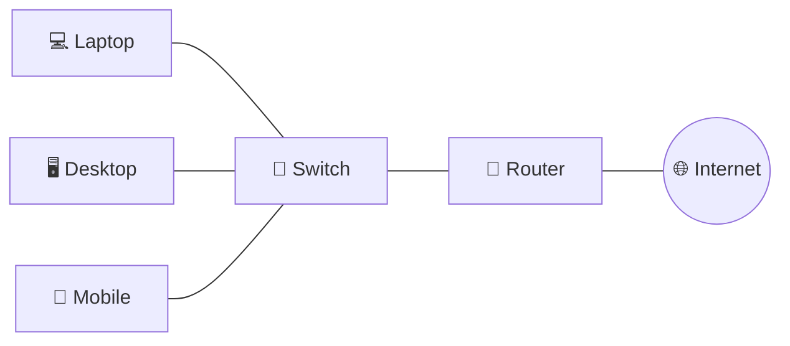

### Types of Networks (by geographic scope)

| Type    | Full Form                 | Range             | Real-World Example                                                    |
| ------- | ------------------------- | ----------------- | --------------------------------------------------------------------- |
| **PAN** | Personal Area Network     | A few meters      | Bluetooth between your phone and earbuds                              |
| **LAN** | Local Area Network        | A building/campus | Office network connecting all employee desktops                       |
| **MAN** | Metropolitan Area Network | A city            | Cable TV network or a city's public Wi-Fi network                     |
| **WAN** | Wide Area Network         | Country/Globe     | The Internet itself, or a company connecting offices across countries |

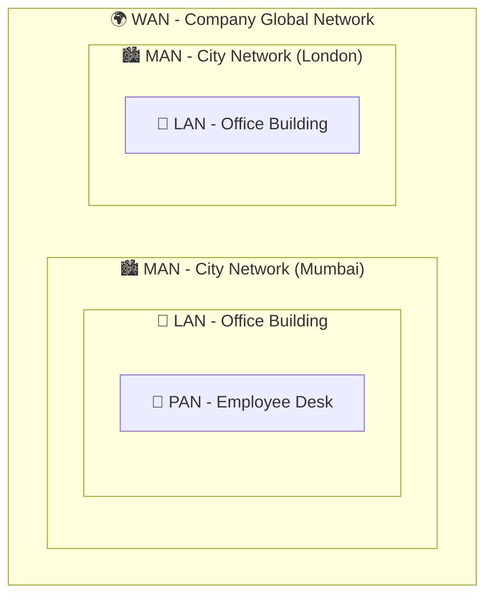

### Internet vs Intranet vs Extranet

| Term         | Description                                         | Access                       | Example                               |
| ------------ | --------------------------------------------------- | ---------------------------- | ------------------------------------- |
| **Internet** | Global public network of networks                   | Public, anyone               | Browsing google.com                   |
| **Intranet** | Private internal network for an organization        | Employees only               | Company's internal HR portal          |
| **Extranet** | Extension of intranet, shared with select outsiders | Employees + trusted partners | A vendor portal shared with suppliers |

> 💡 **DevOps Angle:** Your company's internal Jenkins/GitLab server sits on the **intranet**. When you expose a staging environment to an external QA vendor, you've effectively created an **extranet**.

### Network Devices

#### Hub

- Operates at **Layer 1 (Physical)**.
- Simply **broadcasts** incoming data to _all_ connected ports — no intelligence.
- **Legacy device**, rarely used today (replaced by switches).

#### Switch

- Operates at **Layer 2 (Data Link)**.
- Learns MAC addresses and forwards data **only to the intended device** (using a MAC address table).
- Efficient — no unnecessary broadcast traffic.

#### Router

- Operates at **Layer 3 (Network)**.
- Connects **different networks** together and routes packets based on **IP addresses**.
- Your home Wi-Fi router connects your LAN to your ISP's WAN.

#### Firewall

- Security device/software that **filters traffic** based on rules (IP, port, protocol).
- Can operate at multiple layers (Layer 3/4 for packet filtering, Layer 7 for deep inspection).
- Example: AWS Security Groups, `iptables`, Palo Alto firewalls.

#### Gateway

- A device/node that acts as an **entry/exit point between two different networks** using different protocols.
- Your router often acts as the "default gateway" for your LAN to reach the internet.

#### Modem

- **MO**dulator-**DEM**odulator — converts digital signals from your device into analog signals for transmission over telephone/cable lines (and vice versa).

#### Access Point (AP)

- Allows wireless devices to connect to a wired network using Wi-Fi.

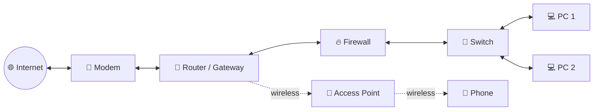

### 📌 Real-World Example

In a typical office:

1. The **modem** connects to the ISP.
2. The **router** connects the office LAN to the internet and assigns local IPs.
3. A **firewall** filters malicious traffic.
4. A **switch** connects all desktops/servers within the office.
5. An **access point** provides Wi-Fi for laptops and phones.

### ❓ Interview Questions — Network Basics

<details>
<summary><b>1. What is the difference between a Hub, Switch, and Router?</b></summary>

A Hub broadcasts data to all ports (Layer 1, no intelligence). A Switch forwards data only to the intended device using MAC addresses (Layer 2). A Router connects different networks and forwards data using IP addresses (Layer 3).

</details>

<details>
<summary><b>2. What's the difference between Intranet and Extranet?</b></summary>

An Intranet is a private network accessible only to an organization's employees. An Extranet extends that access to select external parties like vendors or partners, usually via authentication/VPN.

</details>

<details>
<summary><b>3. Can a network have more than one gateway?</b></summary>

Yes. A device can have multiple gateways for different networks/routes, though only one is typically configured as the "default gateway" for general internet-bound traffic.

</details>

<details>
<summary><b>4. Why are hubs considered obsolete?</b></summary>

Hubs broadcast every packet to every port, causing collisions and wasting bandwidth as more devices are added. Switches solve this by intelligently forwarding data only to the destination MAC address, and are just as cheap now.

</details>

## 2. OSI Model

The **OSI (Open Systems Interconnection) Model** is a 7-layer conceptual framework that standardizes how data travels from one device to another. It was created to help different systems communicate regardless of their underlying architecture.

> 🧠 **Mnemonic to remember all 7 layers (top to bottom):**
> **A**ll **P**eople **S**eem **T**o **N**eed **D**ata **P**rocessing
> _(Application, Presentation, Session, Transport, Network, Data Link, Physical)_

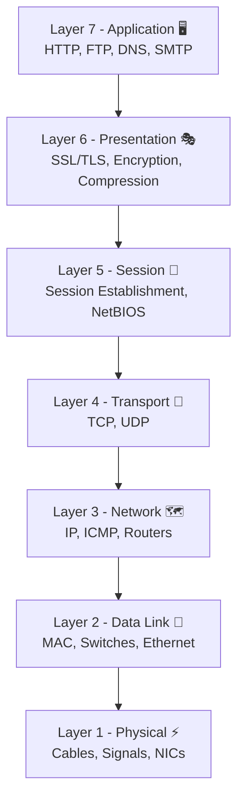

### 🔎 Data Encapsulation Flow

As data moves down the OSI layers on the **sender's side**, each layer adds its own header (encapsulation). On the **receiver's side**, each layer strips its header (de-encapsulation).

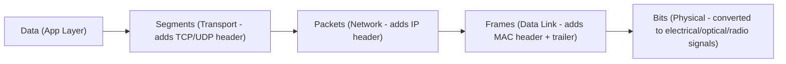

### Layer 7 — Application Layer

| Aspect              | Details                                                                                                                                          |
| ------------------- | ------------------------------------------------------------------------------------------------------------------------------------------------ |
| **Purpose**         | Closest to the end user; provides network services directly to applications (browsers, email clients, etc.)                                      |
| **Protocols**       | HTTP, HTTPS, FTP, SMTP, DNS, DHCP, SSH, Telnet                                                                                                   |
| **Devices**         | Firewalls (Layer 7/application-aware), Load Balancers (Layer 7)                                                                                  |
| **Examples**        | Opening a website in Chrome, sending an email via Outlook                                                                                        |
| **Common Mistakes** | Confusing "the application itself" (e.g., Chrome) with "the Application Layer" (the protocol that lets Chrome talk over the network, e.g., HTTP) |

**Interview Q:** _What's the difference between an application and the Application Layer?_
**A:** The application (e.g., a browser) is software the user interacts with. The Application Layer is the OSI layer defining the protocol (HTTP/HTTPS) that the application uses to communicate over a network.

### Layer 6 — Presentation Layer

| Aspect                  | Details                                                                                                                                                                                                                |
| ----------------------- | ---------------------------------------------------------------------------------------------------------------------------------------------------------------------------------------------------------------------- |
| **Purpose**             | Translates, encrypts, and compresses data so the Application layer can understand it — acts as a "translator"                                                                                                          |
| **Protocols/Standards** | SSL/TLS, JPEG, ASCII, MPEG, encryption standards                                                                                                                                                                       |
| **Devices**             | Not typically a dedicated device; handled in software (SSL termination proxies)                                                                                                                                        |
| **Examples**            | Encrypting an HTTPS request, converting an image to JPEG for transmission                                                                                                                                              |
| **Common Mistakes**     | Thinking encryption _only_ happens here — TLS handshake in HTTPS actually spans Presentation and Session concepts, often modeled purely at Layer 6 in OSI theory but implemented in Layer 4/7 in the real TCP/IP world |

**Interview Q:** _Where does SSL/TLS encryption occur in the OSI model?_
**A:** Conceptually at Layer 6 (Presentation), though in real-world TCP/IP implementations, TLS sits between the Transport and Application layers.

### Layer 5 — Session Layer

| Aspect              | Details                                                                                                                                |
| ------------------- | -------------------------------------------------------------------------------------------------------------------------------------- |
| **Purpose**         | Establishes, manages, and terminates sessions (connections) between two devices; handles synchronization and dialog control            |
| **Protocols**       | NetBIOS, RPC, PPTP, Session establishment in SQL connections                                                                           |
| **Devices**         | Gateways handling session-layer protocols                                                                                              |
| **Examples**        | A video call maintaining a continuous session, a database connection session                                                           |
| **Common Mistakes** | Confusing "Session Layer" with "browser session" (cookies) — cookies are actually an Application Layer (HTTP) concept, not OSI Layer 5 |

**Interview Q:** _Is an HTTP cookie a Layer 5 concept?_
**A:** No. Cookies are managed at the Application Layer (Layer 7) via HTTP headers, even though the _concept_ of maintaining "session state" resembles what Layer 5 handles conceptually.

### Layer 4 — Transport Layer

| Aspect              | Details                                                                                                                        |
| ------------------- | ------------------------------------------------------------------------------------------------------------------------------ |
| **Purpose**         | Ensures complete data transfer with proper sequencing, error checking, and flow control between hosts                          |
| **Protocols**       | TCP (reliable), UDP (fast, connectionless)                                                                                     |
| **Devices**         | Layer 4 Load Balancers (e.g., AWS NLB)                                                                                         |
| **Examples**        | TCP for a file download (must be complete/accurate), UDP for a video call (speed over perfection)                              |
| **Common Mistakes** | Assuming UDP is "unreliable and bad" — it's intentionally lightweight for speed-critical use cases like DNS, streaming, gaming |

**Interview Q:** _Why would you choose UDP over TCP?_
**A:** When speed matters more than guaranteed delivery — e.g., live video streaming, VoIP, DNS queries, and online gaming, where a few dropped packets are preferable to lag from retransmission.

### Layer 3 — Network Layer

| Aspect              | Details                                                                                                     |
| ------------------- | ----------------------------------------------------------------------------------------------------------- |
| **Purpose**         | Handles logical addressing (IP) and routing — determines the _best path_ for data to travel across networks |
| **Protocols**       | IP (IPv4/IPv6), ICMP, IGMP, routing protocols (OSPF, BGP)                                                   |
| **Devices**         | Routers, Layer 3 Switches                                                                                   |
| **Examples**        | Your packet being routed across multiple ISPs to reach a website hosted overseas                            |
| **Common Mistakes** | Confusing "routing" (Layer 3, IP-based) with "switching" (Layer 2, MAC-based)                               |

**Interview Q:** _What's the main job of a router at Layer 3?_
**A:** To examine the destination IP address of a packet and determine the best next-hop path to forward it toward its destination network.

### Layer 2 — Data Link Layer

| Aspect              | Details                                                                                                                                          |
| ------------------- | ------------------------------------------------------------------------------------------------------------------------------------------------ |
| **Purpose**         | Handles node-to-node data transfer and error detection/correction using physical (MAC) addressing within the same network                        |
| **Protocols**       | Ethernet, PPP, ARP (sometimes classified here), VLAN (802.1Q)                                                                                    |
| **Devices**         | Switches, Network Interface Cards (NICs), Bridges                                                                                                |
| **Examples**        | A switch forwarding a frame to the correct device using its MAC address                                                                          |
| **Common Mistakes** | Thinking switches understand IP addresses — standard Layer 2 switches only understand MAC addresses; only Layer 3 switches/routers understand IP |

**Interview Q:** _What are the two sub-layers of the Data Link Layer?_
**A:** LLC (Logical Link Control) — manages frame synchronization and error control, and MAC (Media Access Control) — manages addressing and channel access.

### Layer 1 — Physical Layer

| Aspect                  | Details                                                                                                      |
| ----------------------- | ------------------------------------------------------------------------------------------------------------ |
| **Purpose**             | Transmits raw, unstructured bits (0s and 1s) over a physical medium as electrical, optical, or radio signals |
| **Protocols/Standards** | Ethernet cabling standards, RS-232, Bluetooth (physical spec), USB                                           |
| **Devices**             | Cables (Cat5e/Cat6/Fiber), Hubs, Repeaters, NICs (physical part)                                             |
| **Examples**            | An Ethernet cable carrying electrical signals between your PC and switch                                     |
| **Common Mistakes**     | Assuming "wireless" means "no Physical Layer" — Wi-Fi radio waves are still Layer 1, just a different medium |

**Interview Q:** _Does the Physical Layer care about data meaning?_
**A:** No — it only cares about transmitting raw bits as signals; it has zero awareness of what the data represents.

### 🎯 OSI Model Quick Reference Table

| Layer | Name         | PDU (Data Unit) | Key Protocols                 | Key Devices                |
| ----- | ------------ | --------------- | ----------------------------- | -------------------------- |
| 7     | Application  | Data            | HTTP, FTP, DNS, SMTP          | Firewall (L7), App servers |
| 6     | Presentation | Data            | SSL/TLS, JPEG, ASCII          | —                          |
| 5     | Session      | Data            | NetBIOS, RPC                  | Gateway                    |
| 4     | Transport    | Segment         | TCP, UDP                      | Load Balancer (L4)         |
| 3     | Network      | Packet          | IP, ICMP, OSPF, BGP           | Router                     |
| 2     | Data Link    | Frame           | Ethernet, ARP, VLAN           | Switch, Bridge, NIC        |
| 1     | Physical     | Bits            | Ethernet cabling, Wi-Fi radio | Hub, Cable, Repeater       |

## 3. TCP/IP Model

The **TCP/IP Model** (also called the Internet Protocol Suite) is the **practical, real-world model** the actual internet is built on — while OSI is more of a _theoretical teaching framework_, TCP/IP is what's _actually implemented_.

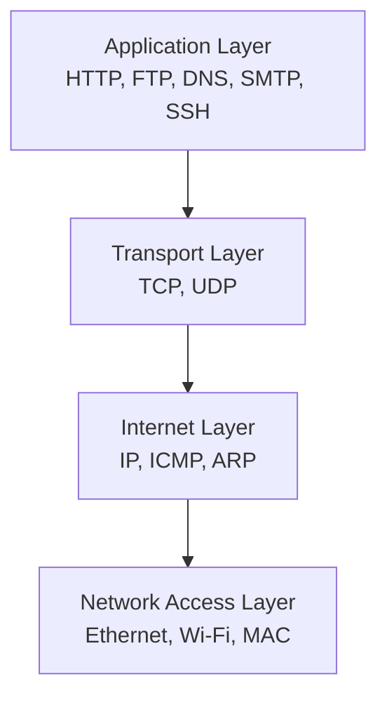

### The 4 Layers Explained

| Layer                                       | Purpose                                                                                                          | Maps to OSI Layers |
| ------------------------------------------- | ---------------------------------------------------------------------------------------------------------------- | ------------------ |
| **Application**                             | Combines OSI's Application, Presentation, and Session layers — handles user-facing protocols and data formatting | Layers 7, 6, 5     |
| **Transport**                               | Manages end-to-end communication, reliability (TCP) or speed (UDP)                                               | Layer 4            |
| **Internet**                                | Handles logical addressing and routing across networks                                                           | Layer 3            |
| **Network Access** (also called Link Layer) | Combines OSI's Data Link and Physical layers — handles hardware addressing and physical transmission             | Layers 2, 1        |

### 📊 OSI vs TCP/IP — Comparison Table

| Feature                 | OSI Model                                            | TCP/IP Model                                      |
| ----------------------- | ---------------------------------------------------- | ------------------------------------------------- |
| **Full Form**           | Open Systems Interconnection                         | Transmission Control Protocol / Internet Protocol |
| **Number of Layers**    | 7                                                    | 4                                                 |
| **Nature**              | Theoretical / Conceptual reference model             | Practical / Implemented on real networks          |
| **Developed By**        | ISO (International Organization for Standardization) | DARPA (US Department of Defense)                  |
| **Layer Approach**      | Layers are strictly separated and defined            | Layers are more loosely combined                  |
| **Usage Today**         | Used for teaching, troubleshooting reference         | Used to build the actual Internet                 |
| **Protocol Dependency** | Protocol-independent (generic)                       | Protocol-dependent (built around TCP/IP suite)    |
| **Reliability**         | Doesn't guarantee delivery by design                 | TCP (within it) guarantees reliable delivery      |

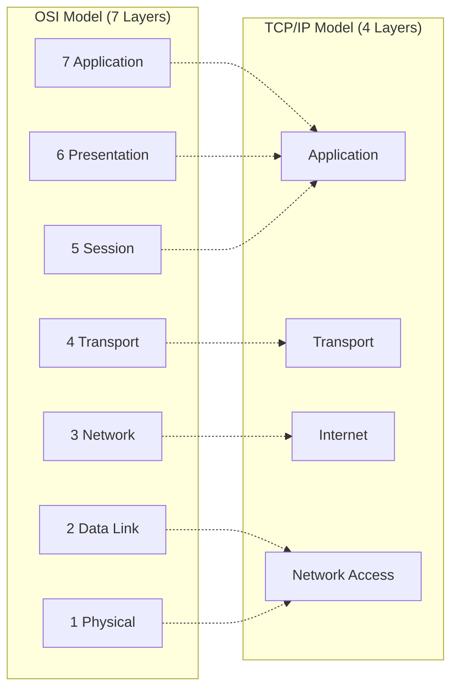

### 📌 Real-World Example

When you type `https://github.com` in your browser:

1. **Application Layer** — Your browser forms an HTTP GET request.
2. **Transport Layer** — TCP breaks it into segments and establishes a connection (3-way handshake) on port 443.
3. **Internet Layer** — IP wraps this into packets, adding source/destination IP addresses, and routes them toward GitHub's servers.
4. **Network Access Layer** — Your NIC converts packets into electrical/radio signals sent to your router, which forwards them onward.

### ❓ Interview Question

**Q: Why does the real world use TCP/IP instead of OSI if OSI is more detailed?**
**A:** OSI was developed as a theoretical reference model _after_ TCP/IP was already in widespread use. TCP/IP is simpler, was battle-tested first (ARPANET), and became the de facto standard — OSI remains valuable as a conceptual teaching and troubleshooting tool.

## 4. IP Addressing

### What is an IP Address?

An **IP (Internet Protocol) Address** is a unique logical identifier assigned to every device on a network so it can be located and communicated with — just like a postal address for your house.

### IPv4 vs IPv6

| Feature               | IPv4                                   | IPv6                                                                  |
| --------------------- | -------------------------------------- | --------------------------------------------------------------------- |
| **Address Length**    | 32-bit                                 | 128-bit                                                               |
| **Format**            | Decimal, dotted (e.g., `192.168.1.1`)  | Hexadecimal, colon-separated (e.g., `2001:0db8:85a3::8a2e:0370:7334`) |
| **Total Addresses**   | ~4.3 billion                           | ~340 undecillion (practically unlimited)                              |
| **Header Complexity** | Complex, includes checksum             | Simplified, no checksum (Faster)                                      |
| **NAT Requirement**   | Often required due to address scarcity | Not required — enough addresses for every device                      |
| **Adoption**          | Still dominant                         | Growing steadily                                                      |

```
IPv4 Example:  192 . 168 .   1  .   1
               (8b)  (8b)  (8b)  (8b)  = 32 bits total

IPv6 Example:  2001:0db8:85a3:0000:0000:8a2e:0370:7334
               8 groups of 16 bits = 128 bits total
```

### Private IP vs Public IP

| Type           | Description                                                       | Range (IPv4 examples)                                                                       |
| -------------- | ----------------------------------------------------------------- | ------------------------------------------------------------------------------------------- |
| **Private IP** | Used within internal/local networks; not routable on the internet | `10.0.0.0 – 10.255.255.255`, `172.16.0.0 – 172.31.255.255`, `192.168.0.0 – 192.168.255.255` |
| **Public IP**  | Globally unique, routable IP assigned by an ISP or cloud provider | Any IP outside the private ranges (e.g., `8.8.8.8`)                                         |

> 💡 **DevOps Example:** An EC2 instance in a private subnet has only a **private IP** (`10.0.1.15`). To reach the internet, it uses a **NAT Gateway** which has a **public IP** or Elastic IP.

### Static IP vs Dynamic IP

| Type           | Description                                | Use Case                                                                  |
| -------------- | ------------------------------------------ | ------------------------------------------------------------------------- |
| **Static IP**  | Manually configured, never changes         | Servers, printers, DNS servers — anything that needs a consistent address |
| **Dynamic IP** | Automatically assigned by DHCP, can change | Regular client devices (laptops, phones)                                  |

### Special IP Addresses

| Type                | Address                                   | Description                                                                    |
| ------------------- | ----------------------------------------- | ------------------------------------------------------------------------------ |
| **Loopback**        | `127.0.0.1` (IPv4), `::1` (IPv6)          | Refers to "this same machine" — used for local testing                         |
| **Broadcast**       | e.g., `192.168.1.255` for a `/24` network | Sends data to _all_ devices on a network segment                               |
| **Network Address** | e.g., `192.168.1.0` for a `/24` network   | Identifies the network itself, not a specific host (first address in a subnet) |
| **Host Address**    | e.g., `192.168.1.10`                      | Identifies a specific device within a network                                  |

### CIDR (Classless Inter-Domain Routing)

CIDR notation expresses an IP address along with its subnet mask using a `/` suffix indicating the number of bits used for the network portion.

```
192.168.1.0/24
             │
             └── 24 bits are the Network portion, remaining 8 bits are for Hosts
```

### Subnet Mask

A subnet mask distinguishes the **network portion** from the **host portion** of an IP address.

| CIDR | Subnet Mask     | Total Hosts | Usable Hosts |
| ---- | --------------- | ----------- | ------------ |
| /8   | 255.0.0.0       | 16,777,216  | 16,777,214   |
| /16  | 255.255.0.0     | 65,536      | 65,534       |
| /24  | 255.255.255.0   | 256         | 254          |
| /25  | 255.255.255.128 | 128         | 126          |
| /26  | 255.255.255.192 | 64          | 62           |
| /27  | 255.255.255.224 | 32          | 30           |
| /28  | 255.255.255.240 | 16          | 14           |
| /30  | 255.255.255.252 | 4           | 2            |

### 🧮 Binary Calculation Example

Convert `192.168.1.10` to binary:

```
192 = 11000000
168 = 10101000
  1 = 00000001
 10 = 00001010

Full IP in binary: 11000000.10101000.00000001.00001010
```

With a `/24` mask (`255.255.255.0` = `11111111.11111111.11111111.00000000`):

- **Network portion:** `11000000.10101000.00000001` → `192.168.1`
- **Host portion:** `00001010` → `.10`

### IP Classes (Classful Addressing — Legacy but still asked in interviews)

| Class | Range                       | Default Mask | Purpose                               |
| ----- | --------------------------- | ------------ | ------------------------------------- |
| **A** | 1.0.0.0 – 126.255.255.255   | /8           | Large networks (huge number of hosts) |
| **B** | 128.0.0.0 – 191.255.255.255 | /16          | Medium-sized networks                 |
| **C** | 192.0.0.0 – 223.255.255.255 | /24          | Small networks                        |
| **D** | 224.0.0.0 – 239.255.255.255 | —            | Multicast                             |
| **E** | 240.0.0.0 – 255.255.255.255 | —            | Reserved/Experimental                 |

### Reserved IPs

| Range             | Purpose                                            |
| ----------------- | -------------------------------------------------- |
| `0.0.0.0/8`       | "This network" / default route                     |
| `127.0.0.0/8`     | Loopback                                           |
| `169.254.0.0/16`  | Link-local (APIPA — auto-assigned when DHCP fails) |
| `224.0.0.0/4`     | Multicast                                          |
| `255.255.255.255` | Limited broadcast                                  |

### 📝 Practice Questions

1. What is the network address and broadcast address for `10.10.10.50/28`?
   <details><summary>Answer</summary>Network: <code>10.10.10.48</code>, Broadcast: <code>10.10.10.63</code> (block size 16: 48–63)</details>

2. How many usable hosts are available in a `/29` network?
   <details><summary>Answer</summary>6 usable hosts (2³ - 2 = 6)</details>

3. Is `169.254.1.5` a valid, routable public IP?
   <details><summary>Answer</summary>No — it's a link-local (APIPA) address, indicating a device failed to get a DHCP lease.</details>

## 5. Subnetting

### Why Subnetting?

Subnetting is the process of **dividing a large network into smaller, logical sub-networks (subnets)**. It's done to:

- ✅ Reduce broadcast traffic (smaller broadcast domains)
- ✅ Improve security (isolate departments/tiers — e.g., separate DB subnet from web subnet)
- ✅ Efficiently use IP address space (don't waste 254 IPs on a network needing only 10)
- ✅ Simplify routing and management

> 💡 **DevOps Example:** In AWS, you create a VPC (`10.0.0.0/16`) then subnet it into a **public subnet** (`10.0.1.0/24` for load balancers) and a **private subnet** (`10.0.2.0/24` for databases/app servers).

### FLSM vs VLSM

| Concept          | FLSM (Fixed-Length)                            | VLSM (Variable-Length)                                             |
| ---------------- | ---------------------------------------------- | ------------------------------------------------------------------ |
| **Full Form**    | Fixed-Length Subnet Mask                       | Variable-Length Subnet Mask                                        |
| **Subnet Sizes** | All subnets are the **same size**              | Subnets can be **different sizes** based on need                   |
| **Efficiency**   | Less efficient — wastes IPs on smaller subnets | Highly efficient — allocates only what's needed                    |
| **Use Case**     | Simple, uniform networks                       | Real-world enterprise/cloud networks with varying department sizes |

### Subnetting Calculation Walkthrough

**Scenario:** You have `192.168.10.0/24` and need 4 subnets.

Since we need 4 subnets, we borrow **2 bits** from the host portion (2² = 4):

```
Original:  192.168.10.0/24  (mask: 255.255.255.0)
New mask:  /26              (255.255.255.192)

Subnet 1: 192.168.10.0/26    → Hosts: .1  to .62   → Broadcast: .63
Subnet 2: 192.168.10.64/26   → Hosts: .65 to .126  → Broadcast: .127
Subnet 3: 192.168.10.128/26  → Hosts: .129 to .190 → Broadcast: .191
Subnet 4: 192.168.10.192/26  → Hosts: .193 to .254 → Broadcast: .255
```

### VLSM Example (Variable Sizes)

**Scenario:** `192.168.20.0/24` split for: Sales (100 hosts), IT (50 hosts), Guest WiFi (20 hosts)

```
Sales (needs 100 hosts → /25 gives 126 usable):
  192.168.20.0/25    → Range: .1 to .126

IT (needs 50 hosts → /26 gives 62 usable):
  192.168.20.128/26  → Range: .129 to .190

Guest WiFi (needs 20 hosts → /27 gives 30 usable):
  192.168.20.192/27  → Range: .193 to .222

Remaining unused: 192.168.20.224/27 (available for future growth)
```

### 📋 Subnetting Cheat Sheet

| CIDR | Subnet Mask     | # Subnets Possible (from /24) | Hosts per Subnet |
| ---- | --------------- | ----------------------------- | ---------------- |
| /24  | 255.255.255.0   | 1                             | 254              |
| /25  | 255.255.255.128 | 2                             | 126              |
| /26  | 255.255.255.192 | 4                             | 62               |
| /27  | 255.255.255.224 | 8                             | 30               |
| /28  | 255.255.255.240 | 16                            | 14               |
| /29  | 255.255.255.248 | 32                            | 6                |
| /30  | 255.255.255.252 | 64                            | 2                |

**Quick Formula:**

```
Number of Hosts = 2^(number of host bits) - 2
Number of Subnets = 2^(number of borrowed bits)
```

### 📝 Exercises

1. Subnet `172.16.0.0/16` into 8 equal subnets. What's the new CIDR and first subnet range?
   <details><summary>Answer</summary>New CIDR: /19 (borrow 3 bits, 2³=8). First subnet: <code>172.16.0.0/19</code>, range .0.1 to .31.254</details>

2. A company needs 4 subnets from `10.1.1.0/24`, each supporting at least 50 hosts. What CIDR fits?
   <details><summary>Answer</summary>/26 (62 usable hosts per subnet, exactly 4 subnets)</details>

### ❓ Common Interview Questions

<details>
<summary><b>What is the difference between subnetting and supernetting?</b></summary>

Subnetting divides a large network into smaller ones (borrowing host bits). Supernetting (route summarization) combines multiple smaller networks into a larger one (borrowing network bits) — used to reduce routing table size.

</details>

<details>
<summary><b>Why can't you use the first and last IP of a subnet for hosts?</b></summary>

The first IP is reserved as the **Network Address** (identifies the subnet itself) and the last IP is reserved as the **Broadcast Address** (used to send data to all hosts in that subnet).

</details>

## 6. MAC Address

### What is a MAC Address?

A **MAC (Media Access Control) Address** is a unique, hardware-burned-in physical address assigned to a Network Interface Card (NIC) — it operates at **Layer 2 (Data Link)**.

```
Format: 6 bytes, written in hexadecimal, separated by colons or hyphens
Example: 00:1A:2B:3C:4D:5E

First 3 bytes (00:1A:2B) = OUI (Organizationally Unique Identifier — identifies manufacturer)
Last 3 bytes (3C:4D:5E)  = Unique device identifier
```

> 💡 **Key Difference:** An IP address can change (dynamic), but a MAC address is (in theory) permanent and tied to the physical hardware — though it _can_ be spoofed/changed in software.

### ARP (Address Resolution Protocol)

ARP resolves an **IP address to a MAC address** — needed because switches forward frames using MAC addresses, but applications communicate using IP addresses.

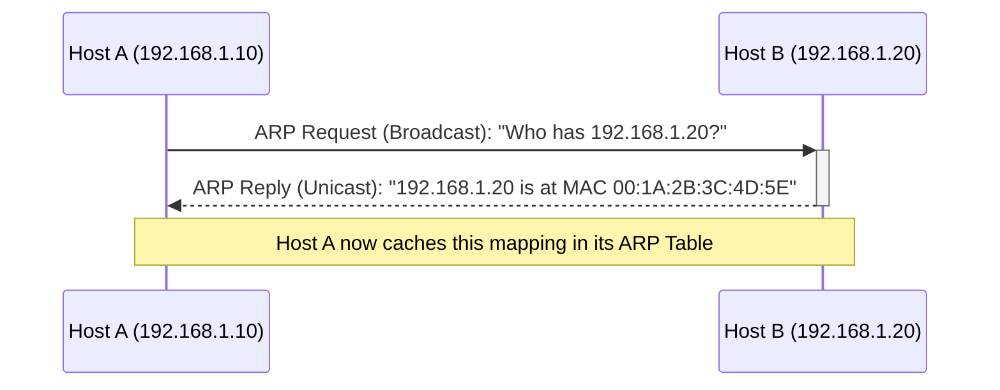

### RARP (Reverse ARP)

RARP does the opposite — resolves a **MAC address to an IP address**. It was historically used by diskless workstations to discover their own IP address at boot (largely replaced today by DHCP).

### ARP Table

The ARP table is a cache stored on each device mapping IP addresses to MAC addresses, avoiding the need to broadcast an ARP request every single time.

### Commands

```bash
# View the ARP cache (legacy command, still works on most systems)
arp -a

# Modern replacement for ARP commands (Linux)
ip neigh show

# Example output of ip neigh:
# 192.168.1.1 dev eth0 lladdr 00:1a:2b:3c:4d:5e REACHABLE
# 192.168.1.20 dev eth0 lladdr 00:1a:2b:3c:4d:5f STALE

# Clear/flush ARP cache entry
sudo ip neigh flush 192.168.1.20
```

### 📌 Real-World Example

When your laptop wants to send data to another device on the same LAN (`192.168.1.20`), it first checks its ARP table. If no entry exists, it broadcasts an ARP request. Every device on the LAN receives it, but only the device owning that IP replies with its MAC address.

## 7. Transport Protocols

### TCP vs UDP

| Feature             | TCP (Transmission Control Protocol)                    | UDP (User Datagram Protocol)           |
| ------------------- | ------------------------------------------------------ | -------------------------------------- |
| **Connection Type** | Connection-oriented (requires handshake)               | Connectionless                         |
| **Reliability**     | Reliable — guarantees delivery & order                 | Unreliable — no guarantee              |
| **Speed**           | Slower (overhead of acknowledgments)                   | Faster (minimal overhead)              |
| **Error Checking**  | Extensive (checksums, retransmission)                  | Basic checksum only, no retransmission |
| **Use Cases**       | Web browsing (HTTP), Email (SMTP), File transfer (FTP) | DNS, Video streaming, VoIP, Gaming     |
| **Header Size**     | 20-60 bytes                                            | 8 bytes                                |

### TCP 3-Way Handshake (Connection Establishment)

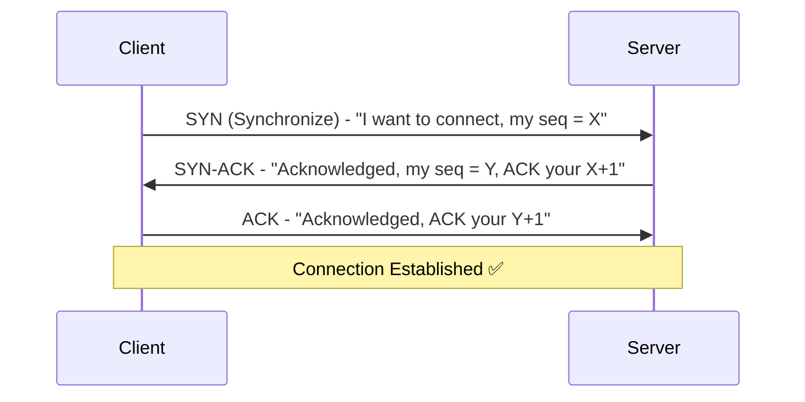

**Explanation:**

1. **SYN** — Client sends a synchronization packet with an initial sequence number.
2. **SYN-ACK** — Server acknowledges and sends its own sequence number.
3. **ACK** — Client acknowledges the server's sequence number. Connection is now open.

### TCP 4-Way Termination (Connection Closure)

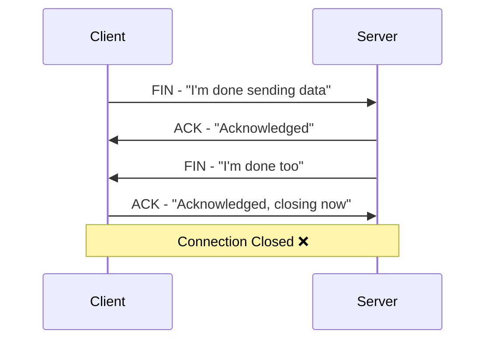

**Why 4 steps instead of 3?** Because TCP is full-duplex — each side must independently close its own direction of data flow (the server may still have data to finish sending after the client says it's done).

### Flow Control

Flow control prevents a **fast sender from overwhelming a slow receiver**. TCP uses a **sliding window** mechanism — the receiver advertises how much data (window size) it can accept, and the sender adjusts accordingly.

### Congestion Control

Congestion control prevents **too much data from overwhelming the network itself** (not just the receiver). TCP algorithms like **Slow Start**, **Congestion Avoidance**, and **Fast Retransmit** dynamically adjust how much data is sent based on detected network congestion (packet loss, delays).

### 📌 Real-World Examples

| Scenario                            | Protocol Used | Why                                                                                  |
| ----------------------------------- | ------------- | ------------------------------------------------------------------------------------ |
| Downloading a file from a server    | TCP           | Every byte must arrive correctly — a corrupted download is useless                   |
| Video call on Zoom/Google Meet      | UDP           | A frozen frame is better than the call awkwardly waiting to retransmit a lost packet |
| DNS lookup                          | UDP (mostly)  | Speed matters; if the query fails, the client just retries                           |
| Kubernetes API server communication | TCP           | Needs reliable, ordered delivery for critical cluster state                          |

## 8. Ports

### What is a Port?

A **port** is a logical, numbered endpoint (0–65535) that allows a single IP address to handle multiple simultaneous network connections/services — think of the IP as an apartment building and the port as the individual apartment number.

### Port Categories

| Category                  | Range         | Description                                                                                         |
| ------------------------- | ------------- | --------------------------------------------------------------------------------------------------- |
| **Well-Known Ports**      | 0 – 1023      | Reserved for standard, common services (HTTP, SSH, DNS, etc.) — require root/admin to bind on Linux |
| **Registered Ports**      | 1024 – 49151  | Registered with IANA for specific vendor applications (e.g., MySQL, PostgreSQL)                     |
| **Dynamic/Private Ports** | 49152 – 65535 | Used temporarily by client applications for outbound connections (ephemeral ports)                  |

### 📋 Complete Port Reference Table

| Port            | Protocol | Service                         | Purpose / Example                                                                                               |
| --------------- | -------- | ------------------------------- | --------------------------------------------------------------------------------------------------------------- |
| **20**          | TCP      | FTP (Data)                      | File Transfer Protocol — actual data transfer channel                                                           |
| **21**          | TCP      | FTP (Control)                   | FTP command/control channel (login, commands)                                                                   |
| **22**          | TCP      | SSH                             | Secure Shell — remote server login, SCP, SFTP, Git over SSH                                                     |
| **23**          | TCP      | Telnet                          | Unencrypted remote login (legacy, insecure — avoid in production)                                               |
| **25**          | TCP      | SMTP                            | Simple Mail Transfer Protocol — sending email between mail servers                                              |
| **53**          | TCP/UDP  | DNS                             | Domain Name System — resolves domain names to IPs (UDP for queries, TCP for zone transfers/large responses)     |
| **67**          | UDP      | DHCP (Server)                   | DHCP server listens here for client requests                                                                    |
| **68**          | UDP      | DHCP (Client)                   | DHCP client listens here for server offers                                                                      |
| **69**          | UDP      | TFTP                            | Trivial File Transfer Protocol — simple file transfers (e.g., PXE boot)                                         |
| **80**          | TCP      | HTTP                            | Unencrypted web traffic                                                                                         |
| **110**         | TCP      | POP3                            | Post Office Protocol v3 — retrieving email (downloads and often deletes from server)                            |
| **123**         | UDP      | NTP                             | Network Time Protocol — clock synchronization across servers (critical for Kerberos, logs, distributed systems) |
| **135**         | TCP      | MS RPC                          | Microsoft RPC endpoint mapper — Windows service communication                                                   |
| **137**         | UDP      | NetBIOS Name Service            | Windows name resolution                                                                                         |
| **138**         | UDP      | NetBIOS Datagram                | Windows datagram service                                                                                        |
| **139**         | TCP      | NetBIOS Session / SMB           | Legacy Windows file/printer sharing                                                                             |
| **143**         | TCP      | IMAP                            | Internet Message Access Protocol — retrieves email while keeping it synced on the server                        |
| **161**         | UDP      | SNMP                            | Simple Network Management Protocol — monitoring/managing network devices                                        |
| **162**         | UDP      | SNMP Trap                       | Receives asynchronous alert notifications from monitored devices                                                |
| **179**         | TCP      | BGP                             | Border Gateway Protocol — routing protocol that runs the entire internet's backbone routing                     |
| **389**         | TCP/UDP  | LDAP                            | Lightweight Directory Access Protocol — centralized authentication/directory services (Active Directory)        |
| **443**         | TCP      | HTTPS                           | Encrypted web traffic (HTTP over TLS/SSL)                                                                       |
| **445**         | TCP      | SMB                             | Server Message Block — Windows file/printer sharing (modern, direct over TCP)                                   |
| **465**         | TCP      | SMTPS                           | SMTP over SSL/TLS (implicit encryption for sending email)                                                       |
| **514**         | UDP      | Syslog                          | System logging protocol — centralized log collection                                                            |
| **587**         | TCP      | SMTP (Submission)               | Modern email submission (with STARTTLS) — used by mail clients to send mail                                     |
| **636**         | TCP      | LDAPS                           | LDAP over SSL/TLS (secure directory queries)                                                                    |
| **993**         | TCP      | IMAPS                           | IMAP over SSL/TLS                                                                                               |
| **995**         | TCP      | POP3S                           | POP3 over SSL/TLS                                                                                               |
| **1433**        | TCP      | Microsoft SQL Server            | Default port for MSSQL database connections                                                                     |
| **1521**        | TCP      | Oracle DB                       | Default port for Oracle database listener                                                                       |
| **2049**        | TCP/UDP  | NFS                             | Network File System — shared file storage across Linux/Unix systems                                             |
| **2375**        | TCP      | Docker (unencrypted)            | Docker daemon API — **insecure**, no TLS (avoid exposing in production)                                         |
| **2376**        | TCP      | Docker (TLS)                    | Docker daemon API secured with TLS                                                                              |
| **2379**        | TCP      | etcd (client)                   | Kubernetes' etcd key-value store — client communication                                                         |
| **2380**        | TCP      | etcd (peer)                     | etcd peer-to-peer communication for cluster consensus                                                           |
| **3000**        | TCP      | Dev Servers / Grafana           | Common default for Node.js apps, React dev server, Grafana dashboard                                            |
| **3306**        | TCP      | MySQL / MariaDB                 | Default database connection port                                                                                |
| **3389**        | TCP      | RDP                             | Remote Desktop Protocol — Windows remote GUI access                                                             |
| **5432**        | TCP      | PostgreSQL                      | Default PostgreSQL database port                                                                                |
| **5601**        | TCP      | Kibana                          | Web UI for visualizing Elasticsearch data (ELK stack)                                                           |
| **5672**        | TCP      | RabbitMQ (AMQP)                 | Message broker communication (Advanced Message Queuing Protocol)                                                |
| **6379**        | TCP      | Redis                           | Default port for Redis in-memory data store                                                                     |
| **6443**        | TCP      | Kubernetes API Server           | The core control-plane endpoint — `kubectl` talks to the cluster here                                           |
| **8000 / 8080** | TCP      | HTTP Alternate                  | Common alternate web ports for dev servers, proxies, Tomcat, Jenkins                                            |
| **8443**        | TCP      | HTTPS Alternate                 | Common alternate secure web port (e.g., Kubernetes dashboards, Tomcat SSL)                                      |
| **9090**        | TCP      | Prometheus                      | Default web UI/API port for Prometheus monitoring                                                               |
| **9093**        | TCP      | Alertmanager                    | Prometheus Alertmanager UI/API                                                                                  |
| **9200**        | TCP      | Elasticsearch (REST API)        | Client/REST queries to Elasticsearch                                                                            |
| **9300**        | TCP      | Elasticsearch (Transport)       | Internal node-to-node cluster communication                                                                     |
| **9418**        | TCP      | Git Protocol                    | Native Git protocol for cloning (unauthenticated, largely superseded by HTTPS/SSH)                              |
| **10250**       | TCP      | Kubelet API                     | Kubernetes node agent API — used by the control plane to manage the node                                        |
| **10255**       | TCP      | Kubelet (read-only, deprecated) | Legacy read-only Kubelet metrics endpoint (removed in modern K8s)                                               |
| **10257**       | TCP      | kube-controller-manager         | Secure HTTPS metrics/health port for the controller manager                                                     |
| **10259**       | TCP      | kube-scheduler                  | Secure HTTPS metrics/health port for the scheduler                                                              |
| **30000-32767** | TCP      | Kubernetes NodePort Range       | Default port range Kubernetes uses to expose Services externally via NodePort                                   |

> ⚠️ **Security Note:** Ports like **2375 (unencrypted Docker API)**, **23 (Telnet)**, and **139/445 (SMB)** are frequent attack vectors. Never expose these directly to the public internet without proper firewalling, VPN, or TLS.

### 🔧 Useful Commands for Ports

```bash
# Check which ports are listening on your machine
ss -tulnp

# Check if a specific port is open on a remote host
nc -zv google.com 443

# Scan common ports on a target (use responsibly, only on systems you own/have permission for)
nmap -p 22,80,443 192.168.1.1

# Check what process is using a specific port
sudo lsof -i :8080
```

## 9. DNS

### What is DNS?

**DNS (Domain Name System)** is the "phonebook of the internet" — it translates human-friendly domain names (like `github.com`) into machine-friendly IP addresses (like `140.82.112.3`).

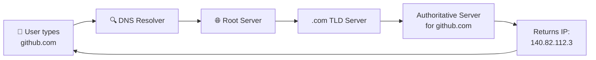

### DNS Record Types

| Record    | Full Name           | Purpose                                                                              | Example                                              |
| --------- | ------------------- | ------------------------------------------------------------------------------------ | ---------------------------------------------------- |
| **A**     | Address Record      | Maps a domain to an IPv4 address                                                     | `example.com → 93.184.216.34`                        |
| **AAAA**  | IPv6 Address Record | Maps a domain to an IPv6 address                                                     | `example.com → 2606:2800:220:1::`                    |
| **MX**    | Mail Exchange       | Specifies mail servers responsible for email delivery                                | `example.com → mail.example.com (priority 10)`       |
| **TXT**   | Text Record         | Stores arbitrary text — often used for verification, SPF/DKIM email security         | `v=spf1 include:_spf.google.com ~all`                |
| **PTR**   | Pointer Record      | Reverse DNS — maps an IP address back to a domain name                               | `34.216.184.93.in-addr.arpa → example.com`           |
| **NS**    | Name Server         | Specifies which servers are authoritative for the domain                             | `example.com → ns1.exampledns.com`                   |
| **CNAME** | Canonical Name      | Aliases one domain name to another                                                   | `www.example.com → example.com`                      |
| **SRV**   | Service Record      | Defines the location (host/port) of specific services                                | `_sip._tcp.example.com → sipserver.example.com:5060` |
| **SOA**   | Start of Authority  | Contains admin info about the domain/zone (primary NS, serial number, refresh times) | Defines zone metadata for `example.com`              |

### DNS Resolution: Recursive vs Iterative Query

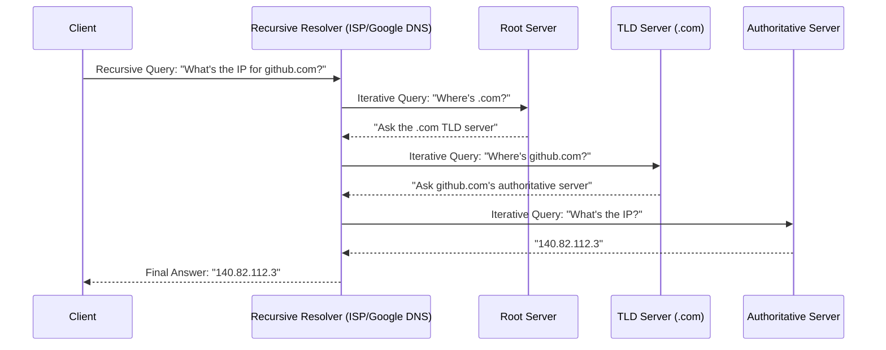

| Query Type          | Description                                                                                                                                                              |
| ------------------- | ------------------------------------------------------------------------------------------------------------------------------------------------------------------------ |
| **Recursive Query** | The client asks the resolver to do _all_ the work and just give back a final answer (or an error) — most common client-to-resolver interaction                           |
| **Iterative Query** | The resolver asks each DNS server in turn, and each server either answers or refers it to the next server — this is how resolvers talk to root/TLD/authoritative servers |

### DNS Commands

```bash
# dig - detailed DNS lookup tool (most powerful, preferred by DevOps engineers)
dig github.com

# Query a specific record type
dig github.com MX

# Query using a specific DNS server
dig @8.8.8.8 github.com

# nslookup - simpler, cross-platform DNS lookup
nslookup github.com

# host - quick and simple DNS lookup
host github.com

# Reverse DNS lookup
dig -x 8.8.8.8
```

### 📌 Real-World Example (DevOps context)

When you deploy an app behind a Kubernetes Ingress and configure `myapp.example.com` in Route 53/Cloud DNS pointing to your Load Balancer's IP, DNS is what allows users worldwide to reach your app by typing a friendly domain name instead of memorizing an IP address that could change.

## 10. DHCP

### What is DHCP?

**DHCP (Dynamic Host Configuration Protocol)** automatically assigns IP addresses, subnet masks, default gateways, and DNS servers to devices joining a network — eliminating the need for manual configuration.

### The DHCP Process — DORA

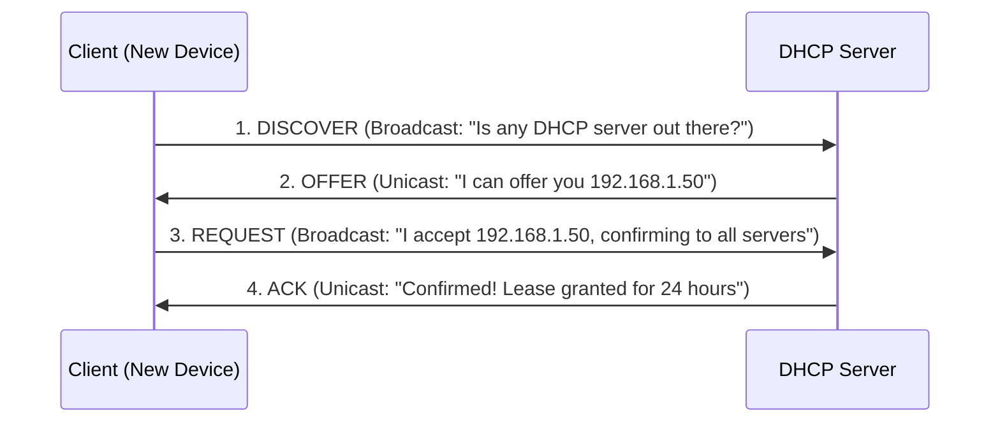

| Step  | Name        | Description                                                                                                    |
| ----- | ----------- | -------------------------------------------------------------------------------------------------------------- |
| **D** | Discover    | Client broadcasts a request looking for any available DHCP server                                              |
| **O** | Offer       | DHCP server responds offering an available IP address                                                          |
| **R** | Request     | Client broadcasts acceptance of the offered IP (broadcast so other DHCP servers know to withdraw their offers) |
| **A** | Acknowledge | Server confirms the lease and finalizes the assignment                                                         |

### Lease & Reservation

| Concept         | Description                                                                                                                                    |
| --------------- | ---------------------------------------------------------------------------------------------------------------------------------------------- |
| **Lease**       | The time period an IP address is assigned to a client before it must renew or release it                                                       |
| **Reservation** | A specific IP address permanently reserved for a specific device (identified by its MAC address), even though it's technically managed by DHCP |

> 💡 **DevOps Example:** In an on-prem data center, you might configure a DHCP reservation so a specific server always gets `10.0.0.50`, giving you DHCP's convenience with static IP predictability.

### Commands

```bash
# Linux: Release current DHCP lease
sudo dhclient -r

# Linux: Request a new DHCP lease
sudo dhclient

# View current IP/lease info
ip a show eth0

# View DHCP lease details (varies by distro)
cat /var/lib/dhcp/dhclient.leases

# Windows equivalent commands
ipconfig /release
ipconfig /renew
```

### 📌 Real-World Example

When a new laptop connects to office Wi-Fi, it has no IP address yet. Through DORA, the DHCP server (often built into the router) automatically assigns it an IP, subnet mask, gateway, and DNS servers — all within milliseconds, with zero manual configuration from the user.

## 11. HTTP & HTTPS

### HTTP Methods

| Method      | Purpose                                       | Idempotent?       | Example Use                                             |
| ----------- | --------------------------------------------- | ----------------- | ------------------------------------------------------- |
| **GET**     | Retrieve data                                 | ✅ Yes            | Fetching a webpage or API resource                      |
| **POST**    | Create new data                               | ❌ No             | Submitting a form, creating a new user                  |
| **PUT**     | Update/replace an entire resource             | ✅ Yes            | Replacing a full user profile object                    |
| **PATCH**   | Partially update a resource                   | ❌ Not guaranteed | Updating just a user's email address                    |
| **DELETE**  | Remove a resource                             | ✅ Yes            | Deleting a record                                       |
| **OPTIONS** | Discover allowed methods/CORS preflight       | ✅ Yes            | Browser checking CORS permissions before actual request |
| **HEAD**    | Same as GET but returns headers only, no body | ✅ Yes            | Checking if a resource exists without downloading it    |

### HTTP Status Codes

| Range   | Category      | Common Examples                                                                                  |
| ------- | ------------- | ------------------------------------------------------------------------------------------------ |
| **1xx** | Informational | `100 Continue`                                                                                   |
| **2xx** | Success       | `200 OK`, `201 Created`, `204 No Content`                                                        |
| **3xx** | Redirection   | `301 Moved Permanently`, `302 Found`, `304 Not Modified`                                         |
| **4xx** | Client Error  | `400 Bad Request`, `401 Unauthorized`, `403 Forbidden`, `404 Not Found`, `429 Too Many Requests` |
| **5xx** | Server Error  | `500 Internal Server Error`, `502 Bad Gateway`, `503 Service Unavailable`, `504 Gateway Timeout` |

> 💡 **DevOps Debugging Tip:** `502 Bad Gateway` usually means your reverse proxy/load balancer _can't reach_ the backend service. `504 Gateway Timeout` means it reached the backend, but the backend took too long to respond. Knowing this difference saves hours of debugging.

### SSL vs TLS

| Term                               | Description                                                                                  |
| ---------------------------------- | -------------------------------------------------------------------------------------------- |
| **SSL (Secure Sockets Layer)**     | The original encryption protocol — now considered obsolete/insecure (SSL 2.0/3.0 deprecated) |
| **TLS (Transport Layer Security)** | The modern successor to SSL — what "HTTPS" actually uses today (TLS 1.2/1.3)                 |

> Note: The term "SSL certificate" is still used colloquially in the industry, even though it almost always refers to a **TLS certificate** in practice.

### Certificates

An **SSL/TLS certificate** is a digital file that binds a cryptographic key to an organization's details, issued by a **Certificate Authority (CA)** like Let's Encrypt, DigiCert, or AWS Certificate Manager. It enables:

- **Encryption** — scrambles data so it can't be read in transit
- **Authentication** — proves the server is who it claims to be
- **Data Integrity** — ensures data wasn't tampered with in transit

### HTTPS Handshake (TLS Handshake) — Simplified

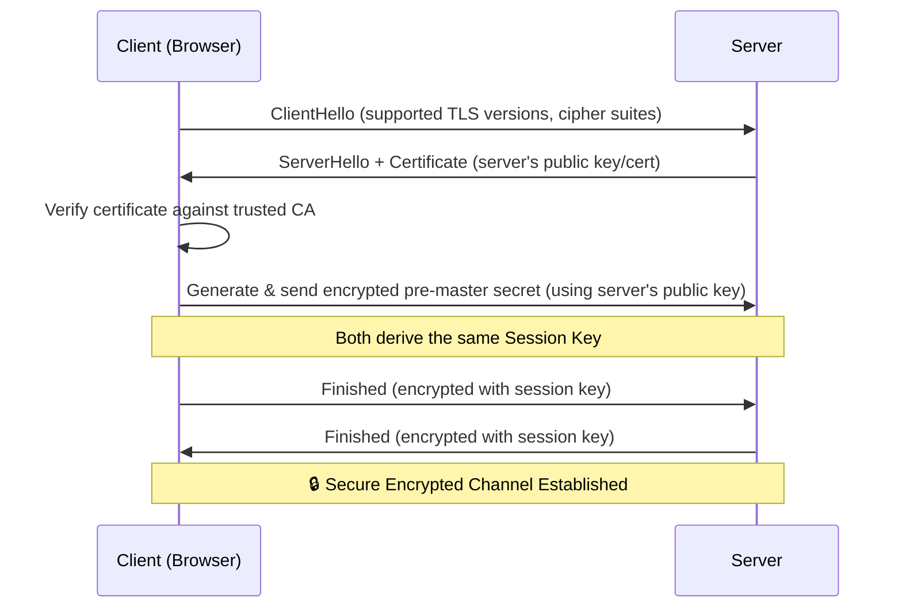

### 📌 Real-World Example

When you visit `https://github.com`:

1. Your browser and GitHub's server perform a TLS handshake (above).
2. Your browser verifies GitHub's certificate is valid and signed by a trusted CA.
3. Once the handshake completes, all subsequent HTTP data (headers, cookies, page content) is encrypted — invisible to anyone intercepting the traffic (like on public Wi-Fi).

## 12. SSH

### What is SSH?

**SSH (Secure Shell)** is an encrypted protocol (port 22) used to securely access and manage remote servers over an untrusted network. It's the single most-used tool in a DevOps engineer's daily toolkit.

### SSH Authentication Methods

| Method                      | Description                                                                  | Security Level                               |
| --------------------------- | ---------------------------------------------------------------------------- | -------------------------------------------- |
| **Password Authentication** | User enters a password to log in                                             | ⚠️ Lower — vulnerable to brute-force attacks |
| **Key Pair Authentication** | User has a private key (kept secret) and a public key (placed on the server) | ✅ Higher — industry standard for production |

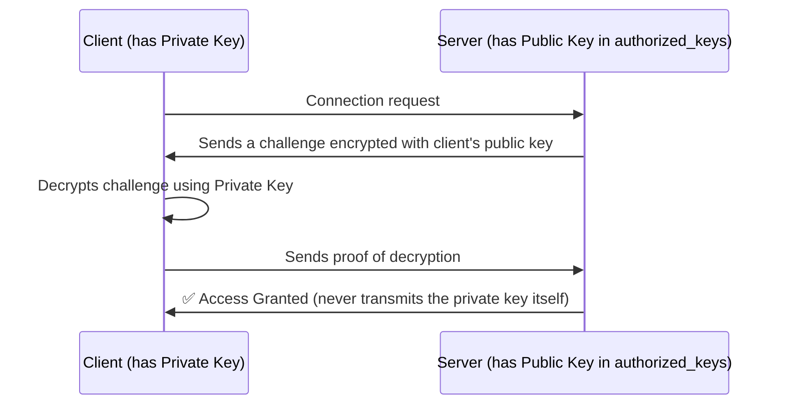

### Key Concepts

| Term                | Description                                                                                                                                       |
| ------------------- | ------------------------------------------------------------------------------------------------------------------------------------------------- |
| **Authorized Keys** | File on the **server** (`~/.ssh/authorized_keys`) listing public keys allowed to log in                                                           |
| **Known Hosts**     | File on the **client** (`~/.ssh/known_hosts`) storing fingerprints of servers you've previously connected to (prevents man-in-the-middle attacks) |
| **SSH Config**      | Client-side config file (`~/.ssh/config`) to define shortcuts, users, ports, and keys per host                                                    |

### SSH Config Example

```bash
# ~/.ssh/config
Host prod-server
    HostName 203.0.113.10
    User devops
    Port 2222
    IdentityFile ~/.ssh/prod_key

Host staging
    HostName 198.51.100.20
    User ubuntu
    IdentityFile ~/.ssh/staging_key
```

With this config, you can simply run `ssh prod-server` instead of typing the full command every time.

### SCP, SFTP, and ssh-agent

```bash
# scp - Secure Copy (copy files over SSH)
scp file.txt user@server:/home/user/
scp -r ./project user@server:/var/www/    # recursive, copy a directory

# sftp - Secure File Transfer Protocol (interactive file transfer session)
sftp user@server
sftp> put localfile.txt
sftp> get remotefile.txt

# ssh-agent - caches your decrypted private key in memory so you don't
# have to re-enter your passphrase for every connection
eval "$(ssh-agent -s)"
ssh-add ~/.ssh/id_rsa
```

### Generating an SSH Key Pair

```bash
# Generate a modern, secure Ed25519 key pair
ssh-keygen -t ed25519 -C "your_email@example.com"

# Copy your public key to a remote server
ssh-copy-id user@server
```

### 🛡️ SSH Best Practices

- ✅ **Disable password authentication** — use key-based auth only (`PasswordAuthentication no` in `sshd_config`)
- ✅ **Disable root login** — use `PermitRootLogin no`, log in as a regular user and `sudo` when needed
- ✅ **Change the default port** (22) to reduce automated bot scanning noise (security through obscurity — not a substitute for other hardening)
- ✅ **Use `fail2ban`** to block IPs after repeated failed login attempts
- ✅ **Restrict SSH access** via firewall/Security Groups to known IP ranges (bastion hosts, VPN)
- ✅ **Rotate and protect private keys** — never commit them to Git repositories
- ✅ **Use SSH certificates** (via tools like HashiCorp Vault) for short-lived, auditable access in larger organizations

## 13. NAT

### What is NAT?

**NAT (Network Address Translation)** allows devices with private IP addresses to communicate with the public internet by translating private IPs to a public IP (and back).

### SNAT (Source NAT)

Translates the **source** IP address of outgoing packets — typically used when private/internal devices need to reach the internet.

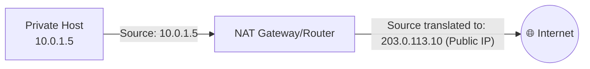

### DNAT (Destination NAT)

Translates the **destination** IP address of incoming packets — typically used to expose an internal service to the outside world (e.g., port forwarding).

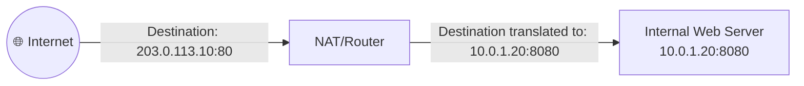

### PAT (Port Address Translation)

A specific form of SNAT (also called **NAT Overload**) where **many private IPs share a single public IP**, distinguished by unique port numbers. This is what most home routers use.

| Private IP:Port   | Translated Public IP:Port |
| ----------------- | ------------------------- |
| 192.168.1.10:5000 | 203.0.113.10:40001        |
| 192.168.1.11:5000 | 203.0.113.10:40002        |
| 192.168.1.12:5000 | 203.0.113.10:40003        |

### NAT Comparison Table

| Type     | Translates       | Direction | Common Use                                                                   |
| -------- | ---------------- | --------- | ---------------------------------------------------------------------------- |
| **SNAT** | Source IP        | Outbound  | Private hosts accessing the internet                                         |
| **DNAT** | Destination IP   | Inbound   | Exposing an internal server publicly (port forwarding)                       |
| **PAT**  | Source IP + Port | Outbound  | Multiple private hosts sharing one public IP (most common home/office setup) |

### AWS NAT Gateway

An **AWS NAT Gateway** is a managed service that allows instances in a **private subnet** to initiate outbound connections to the internet (e.g., to download OS updates or call external APIs) **without** exposing them to unsolicited inbound traffic from the internet.

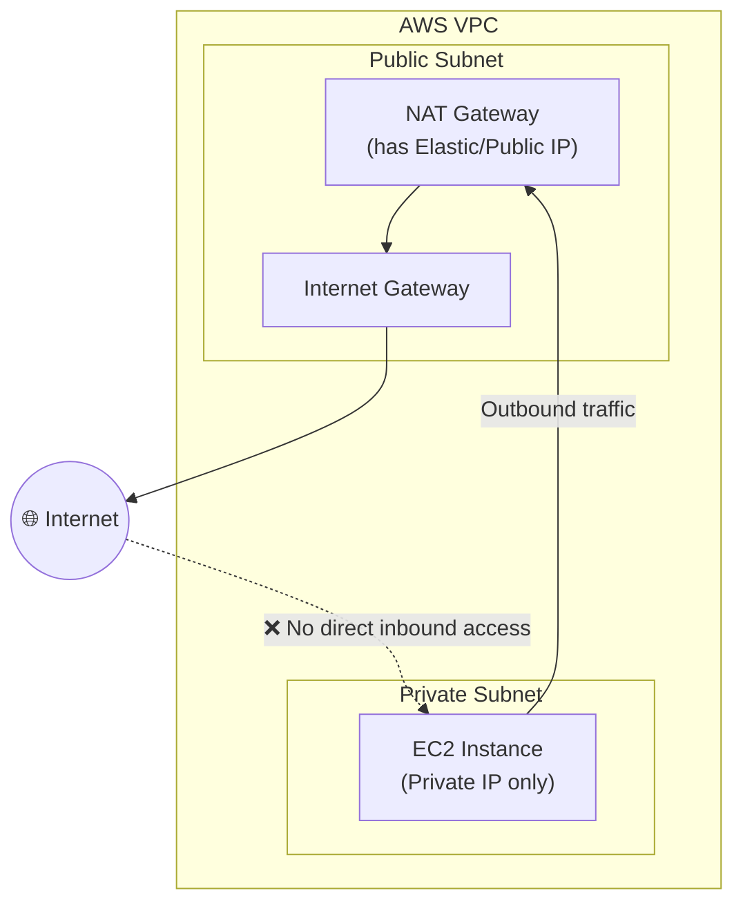

> 💡 **Key DevOps Insight:** A NAT Gateway is **one-way** — it lets private instances talk _out_ to the internet, but the internet **cannot** initiate a connection _in_ to those private instances. This is a fundamental AWS security pattern for databases and internal app servers.

## 14. VPN

### What is a VPN?

A **VPN (Virtual Private Network)** creates an encrypted "tunnel" over a public network (like the internet), allowing private, secure communication as if devices were on the same local network.

### Site-to-Site VPN

Connects **two entire networks** (e.g., your on-prem data center and your AWS VPC) together permanently, so all devices on both sides can communicate securely.

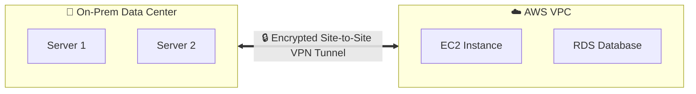

### Remote Access VPN

Connects an **individual user's device** to a private network remotely — commonly used for employees working from home connecting to company resources.

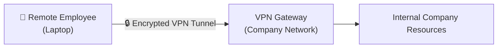

### OpenVPN

- A widely-used, mature, **open-source** VPN solution.
- Uses SSL/TLS for key exchange, highly configurable.
- Slightly heavier/slower compared to newer alternatives like WireGuard, but extremely flexible and battle-tested.

### WireGuard

- A **modern, lightweight** VPN protocol built into the Linux kernel.
- Much simpler codebase (~4,000 lines vs OpenVPN's ~100,000+), making it easier to audit and faster to establish connections.
- Uses state-of-the-art cryptography by default (no legacy cipher baggage).
- Increasingly the preferred choice for new DevOps/cloud VPN implementations.

| Feature                      | OpenVPN                            | WireGuard                               |
| ---------------------------- | ---------------------------------- | --------------------------------------- |
| **Codebase Size**            | Large (~100k+ lines)               | Small (~4k lines)                       |
| **Speed**                    | Moderate                           | Very Fast                               |
| **Configuration Complexity** | More complex                       | Simple                                  |
| **Cryptography**             | Configurable (many cipher options) | Fixed, modern, opinionated cipher suite |
| **Kernel Integration**       | No (userspace)                     | Yes (Linux kernel module)               |

### AWS VPN

AWS offers managed VPN services:

- **AWS Site-to-Site VPN** — connects your on-premises network to your AWS VPC over an encrypted IPsec tunnel.
- **AWS Client VPN** — a managed remote-access VPN service allowing individual users to securely connect to AWS resources and on-prem networks.

```mermaid
graph LR
    subgraph OnPrem["🏢 On-Premises"]
        CGW["Customer Gateway"]
    end
    subgraph AWS["☁️ AWS"]
        VGW["Virtual Private Gateway"]
        VPC["VPC Resources"]
    end
    CGW <==>|"IPsec Tunnel"| VGW
    VGW --> VPC
```

> 💡 **DevOps Use Case:** Many organizations use **Site-to-Site VPN** or **AWS Direct Connect** so their on-prem CI/CD runners or databases can securely communicate with cloud resources without traversing the public internet unencrypted.

## 15. Reverse Proxy

### What is a Reverse Proxy?

A **Reverse Proxy** is a server that sits **in front of one or more backend servers**, intercepting client requests and forwarding them to the appropriate backend — while the client only ever sees the proxy, never the actual backend servers directly.

> 🆚 **Forward Proxy vs Reverse Proxy:**
>
> - A **Forward Proxy** sits in front of **clients**, hiding client identity from the server (e.g., a corporate proxy hiding employee IPs from the internet).
> - A **Reverse Proxy** sits in front of **servers**, hiding backend server details from the client (e.g., Nginx hiding your actual app servers from the public internet).

```mermaid
graph LR
    Client1[👤 Client 1] --> RP["🔀 Reverse Proxy<br/>(Nginx/HAProxy)"]
    Client2[👤 Client 2] --> RP
    Client3[👤 Client 3] --> RP
    RP --> S1["Backend Server 1"]
    RP --> S2["Backend Server 2"]
    RP --> S3["Backend Server 3"]
```

### Why Use a Reverse Proxy?

| Benefit                 | Description                                                                                 |
| ----------------------- | ------------------------------------------------------------------------------------------- |
| **Load Balancing**      | Distributes incoming traffic across multiple backend servers                                |
| **SSL/TLS Termination** | Handles HTTPS encryption/decryption centrally, so backend servers only deal with plain HTTP |
| **Security**            | Hides internal server IPs/architecture from the public, reducing the attack surface         |
| **Caching**             | Can cache static content to reduce load on backend servers                                  |
| **Compression**         | Can compress responses (gzip) before sending to clients                                     |
| **Single Entry Point**  | Simplifies routing multiple services/domains through one public-facing address              |

### Common Reverse Proxy Tools

- **Nginx** — extremely popular, lightweight, high-performance
- **HAProxy** — specialized in high-availability load balancing
- **Traefik** — modern, cloud-native, auto-discovers services (popular in Docker/Kubernetes)
- **Envoy** — used heavily in service mesh architectures (e.g., Istio)

### 📌 Real-World Example (Kubernetes Ingress)

In Kubernetes, an **Ingress Controller** (commonly Nginx or Traefik under the hood) acts as a reverse proxy — routing external HTTP/HTTPS traffic to the correct internal Service/Pod based on hostname or URL path.

```mermaid
graph LR
    U[👤 User] -->|"api.example.com"| ING["Ingress Controller<br/>(Reverse Proxy)"]
    ING -->|"/orders → orders-service"| S1[Orders Service]
    ING -->|"/users → users-service"| S2[Users Service]
    ING -->|"/payments → payments-service"| S3[Payments Service]
```

### Basic Nginx Reverse Proxy Config Example

```nginx
server {
    listen 80;
    server_name example.com;

    location / {
        proxy_pass http://backend_server:3000;
        proxy_set_header Host $host;
        proxy_set_header X-Real-IP $remote_addr;
        proxy_set_header X-Forwarded-For $proxy_add_x_forwarded_for;
        proxy_set_header X-Forwarded-Proto $scheme;
    }
}
```

<div align="center">

## 🎓 You've Completed the Roadmap!

You now have a structured reference covering networking from **fundamentals to advanced, cloud-native concepts**. Revisit sections as needed, practice the exercises, and try replicating diagrams/commands in a home lab (VirtualBox, Docker, or a free-tier cloud account) to cement your understanding.

### 📚 Suggested Next Steps

- Set up a home lab with Docker/Kubernetes and practice inspecting networks (`docker network inspect`, `kubectl get svc`)
- Practice subnetting daily until calculations become instant
- Build a VPC from scratch in AWS/GCP/Azure with public + private subnets, NAT Gateway, and a bastion host
- Set up an Nginx reverse proxy in front of a sample app
- Configure a WireGuard VPN tunnel between two test VMs

⭐ **If this guide helped you, consider starring the repository and sharing it with fellow DevOps learners.**

</div>
